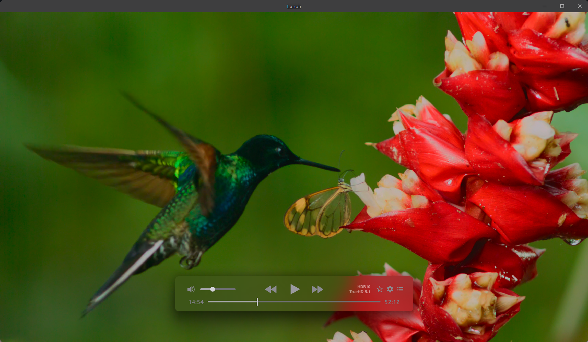
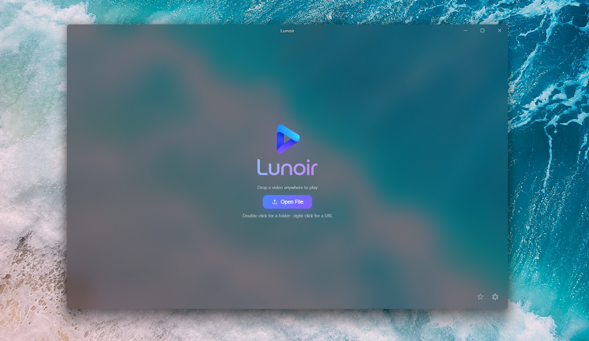
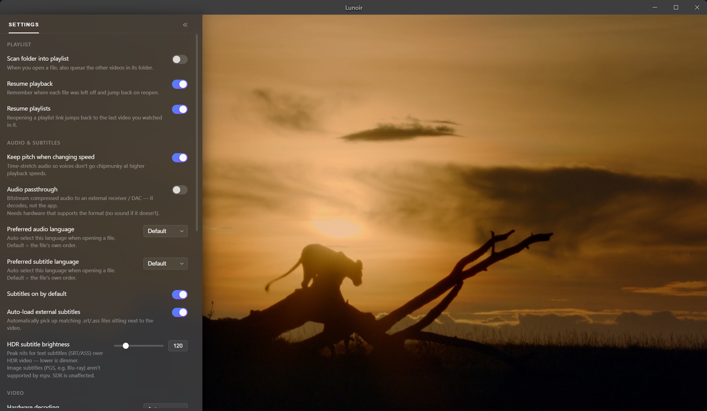
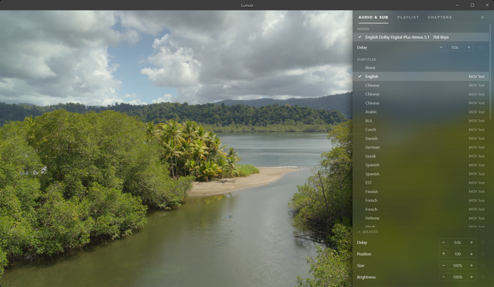

<p align="center">
  
</p>


A Modern Windows media player with an [**mpv**](https://mpv.io/) core and an
[**IINA**](https://iina.io/)-inspired interface — frameless, frosted-glass, and
built for people who care about frame accuracy and colour fidelity.

Built with Electron + React. mpv does the heavy lifting; Lunoir wraps it in a
clean Win11 acrylic UI.


> ⚠️ Early / personal project. Windows-only for now. Expect rough edges.
>
> Lunoir is an **independent** project — not affiliated with, or endorsed by,
> [IINA](https://iina.io/) or [mpv](https://mpv.io/). The interface is inspired by
> IINA's design; none of IINA's code is used.

## Screenshots

<p align="center">
  
</p>

| Home | Settings | Audio &amp; subtitle tracks |
| :---: | :---: | :---: |
|  |  |  |

## Features

**Playback (mpv core)**
- Plays essentially everything mpv/FFmpeg does — MKV, MP4, MOV, TS, M2TS, WebM…
- `gpu-next` rendering: Dolby Vision, HDR10 / HDR10+ tone-mapping, 10-bit
- Blu-ray / DVD disc **folders** (`bd://` / `dvd://`), plays the main title
- Online video & **playlists** via yt-dlp (YouTube, etc.)

**Interface**
- Floating IINA-style OSC that frosts the video (real Win11 acrylic window)
- Acrylic side panels — playlist / chapters / audio & subtitle tracks, and settings
- **9 interface languages** — English, 简体中文, Français, Deutsch, Español,
  Português, Русский, 日本語, 한국어 (auto-detects your Windows language)
- Frameless, drag-and-drop, opens files straight from Explorer (file associations)
- Right-click context menu, remembers window size & volume

**For frame-accurate work**
- Time / **timecode** (SMPTE `HH:MM:SS:FF`) / **frame-number** readout — click to cycle
- True single-frame stepping, and an optional always-on corner **burn-in** that
  screenshots capture
- Rich track info via MediaInfo — commercial audio names (Dolby TrueHD / Atmos,
  DTS-HD) and an HDR-flavour badge (DV / HDR10 / HDR10+)

**Niceties**
- Screenshots (PNG / JPG, with or without subtitles, custom folder, named by title + position)
- **Subtitle styling** — font, size, spacing, outline, position — plus per-video
  delay / position / size / brightness tweaks
- A-B loop, playback speed (keeps pitch), shuffle / repeat, auto-load external subtitles
- Audio passthrough (bitstream to a receiver), adjustable OSC auto-hide delay
- Resume playback — per file *and* per playlist

## Requirements

- Windows 10 / 11 (acrylic effects look best on Win11)
- [Node.js](https://nodejs.org/) 18+ (to build from source)

## Getting started

```bash
npm install      # install dependencies
npm run setup    # download mpv + MediaInfo into resources/
npm run dev      # launch in development
```

## Building an installer

```bash
npm run dist     # produce a Windows installer in dist/
```

## Keyboard shortcuts

| Key | Action |
| --- | --- |
| Space / K | Play / Pause |
| ← / → | Seek ∓5s |
| ← / → | Step frame (When Paused) |
| ↑ / ↓ | Volume ±5 |
| F | Fullscreen |
| M | Mute |
| Ctrl+O | Open file |

More actions live in the **right-click menu** and the **settings panel**.

## How it works

mpv renders video into the main window via `--wid` and is controlled over a JSON
IPC named pipe. The frosted controls (OSC) and the side panels are **separate
Win11 acrylic child windows** layered over the video — the only way to get the
system frosted-glass effect to actually sample the mpv video underneath. The
React renderer is window-agnostic; the Electron main process owns mpv, the
windows, and their layout/animation.

## Credits

Powered by [mpv](https://mpv.io/), [FFmpeg](https://ffmpeg.org/),
[yt-dlp](https://github.com/yt-dlp/yt-dlp) and
[MediaInfo](https://mediaarea.net/en/MediaInfo); UI inspired by
[IINA](https://iina.io/). See [CREDITS.md](CREDITS.md) for licenses.

## Acknowledgments

Built by [@zhbj420](https://github.com/zhbj420) together with [Claude](https://www.anthropic.com/claude) (Anthropic) as a pair-programmer — from the first prototype to this release.

## License

[MIT](LICENSE) © 2026 Yao666
